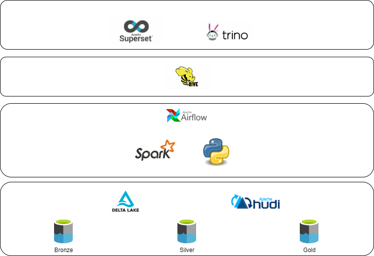

# Open Data Lake Infrastructure
Project to define an open source development environment for Data Lake projects. The project is only intened to be used for experimenting with Data Lake infrastructures based on Apache technologies. No security is implemented.

The tech stack looks as follows:
-----

Docker overview
---

## Getting started
- The project may be started by first running `build.ps1` to build all custom images. 
- Git repo should be initialized in [/src/nifi/](/src/nifi/) in order to use the Nifi registry. 
- Add necessary secrets to environment variables. The below steps indicate one way to do so
  - The [.env.temp](.env.temp) shows which secrets are necessary and a new filew `.env` should be created with the values populated
  - Run [dot_env_to_env_vars.ps1](./dot_env_to_env_vars.ps1) to add values from the newly created `.env` file to the environment variables
- Run [env_vars_in_files.ps1](./env_vars_in_files.ps1) to populate files with secretes from the environmnet variables. All occurences like `${azure_client_oauth2_id}` are replaced with the value of an environment variable with the same name 
- Spin up all services with Docker-Compose.
- To configure Apache Superset the first time execute [superset_init.sh](./superset_init.sh) from within the container

### Datahub
- If containers are to be recreated, it is important to delete the associated managed volumes first in order to avoid a conflict in cluster id
- To ingest data from Trino with [trino-delta.yaml](./scripts/datahub/trino-delta.yaml) run `datahub ingest -c .\trino-delta.yaml`
  - To install the Datahub CLI, simply run 
    - `python -m pip install --upgrade pip wheel setuptools`
    - `python -m pip install --upgrade acryl-datahub`
    - `python -m pip install 'acryl-datahub[trino]'`

### Apache Hudi
Hudi is not added beforehand, but is downloaded as part of the initiation of the sparkSession in [hudi_test](/src/jupyter/hudi_test.ipynb)

### Apache Superset
When connecting Trino to Superset use the following url for local docker instances trino://trino@host.docker.internal:8080/<name of catalog>. If running from something like gitpod the uri should be trino://trino@trino-coordinator:8080/<name of catalog>

### Apache Airflow
When the container is created a connection called "spark_conn" should be created and it should contain information on the jars to be installed. Below is an example:

### Handle dependencies
In this setup, spark is run in a standalone cluster, which means all spark-submit jobs are executed in client mode. Therefore the driver is executed from the client, which is airflow-worker, and thus airflow-worker needs to have access to all necessary dependencies. This includes local modules and packages installed from PyPi. Volumes have been used to ensure simultanous existence on local modules in airflow-worker and ad-hoc. Furthermore, relevant environment variables are added to both containers in the Docker-compose file

